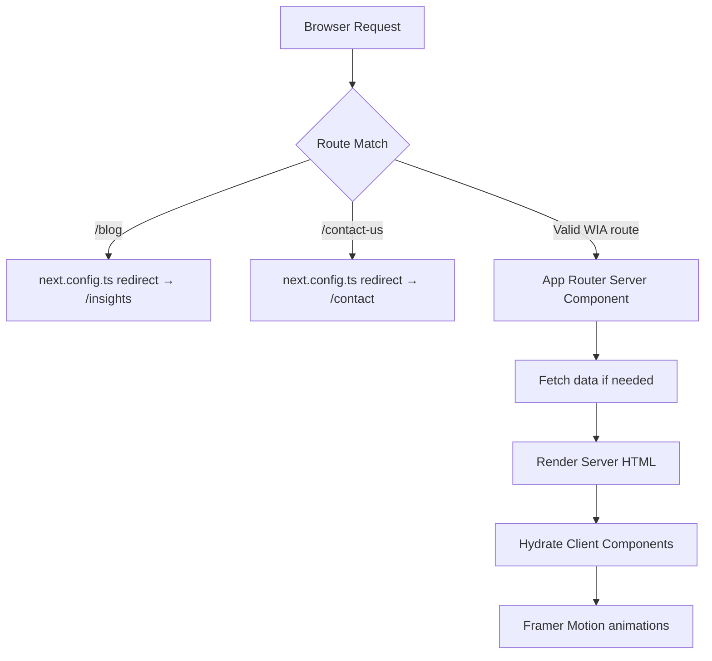
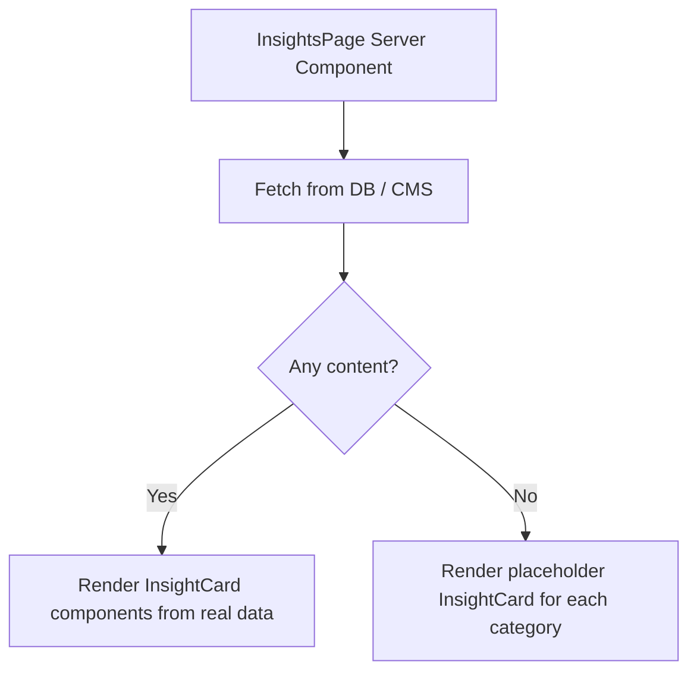

# Design Document — WorldImpact Group Website Rebrand

## Overview

This document describes the technical design for rebranding the existing Next.js application from "Prime Edge Interiors & Construction" to the **WorldImpact Group** identity. The work touches every layer of the codebase: design tokens, global layout, shared components (NavBar, Footer), the home page, eight content pages (three new detail pages, two reworked pages, three brand-new routes), legacy route removal, redirect configuration, and sitemap updates.

The goal is a clean swap with zero Prime Edge artefacts remaining in the production build. No new infrastructure is introduced; the stack remains Next.js 16 (App Router), TypeScript, Tailwind CSS v4 (`@theme inline`), Framer Motion, Prisma (PostgreSQL / Neon), and Cloudinary.

### Key Design Principles

- **Token-first theming** — all brand colours are defined once in `globals.css` as CSS custom properties and consumed everywhere via Tailwind utility classes. No raw hex values in component files.
- **Content-component separation** — each page is split into a lightweight async Server Component (`page.tsx`) that owns metadata/data-fetching and a `*Content.tsx` Client Component for interactive UI, following the existing pattern.
- **Progressive disclosure** — the NavBar Solutions dropdown and mobile drawer reveal depth only when needed, keeping the top-level chrome minimal.
- **Graceful degradation on the Insights page** — placeholder cards fill the page when no database content exists, preventing an empty state that would look broken to visitors or during initial deployment.

---

## Architecture

### File System Layout (After Rebrand)

```
src/
├── app/
│   ├── about/                     (updated)
│   ├── certifications/            (new)
│   ├── contact/                   (updated — consolidates /contact-us)
│   ├── contact-us/                (removed)
│   ├── corporate-training/        (new)
│   ├── get-started/               (new)
│   ├── insights/                  (new — replaces /blog)
│   ├── blog/                      (removed — redirect via next.config.ts)
│   ├── projects/                  (removed)
│   ├── services/                  (removed)
│   ├── shop/                      (removed)
│   ├── shipping-returns/          (removed)
│   ├── solutions/                 (new)
│   ├── talent-solutions/          (new)
│   ├── team/                      (removed)
│   ├── admin/                     (unchanged)
│   ├── privacy/                   (unchanged)
│   ├── terms/                     (unchanged)
│   ├── globals.css                (updated tokens)
│   ├── layout.tsx                 (updated metadata + JSON-LD)
│   ├── page.tsx                   (rebuilt home page)
│   └── sitemap.ts                 (updated)
├── components/
│   ├── NavBar.tsx                 (rebuilt)
│   ├── Footer.tsx                 (rebuilt)
│   ├── Hero.tsx                   (rebuilt)
│   ├── PageHero.tsx               (unchanged — reused by all inner pages)
│   ├── WhoWeAre.tsx               (new)
│   ├── WhatWeDo.tsx               (new)
│   ├── IndustriesServed.tsx       (updated content)
│   ├── PartnersAccreditations.tsx (new)
│   ├── GovernmentPartnerships.tsx (new)
│   ├── WhyWorldImpact.tsx         (replaces WhyChooseUs)
│   ├── HomeClosingCTA.tsx         (new)
│   ├── StatsCounter.tsx           (updated copy — reuse if applicable)
│   ├── Testimonials.tsx           (updated copy)
│   ├── FAQ.tsx                    (updated copy)
│   ├── InsightCard.tsx            (new)
│   └── GetStartedFlow.tsx         (new)
└── lib/
    ├── cloudinary.ts              (unchanged)
    ├── db.ts                      (unchanged)
    ├── prisma.ts                  (unchanged)
    ├── projects-data.ts           (removed — no longer consumed)
    └── services-data.ts           (removed — no longer consumed)
```

### Request / Render Flow



### Redirect Configuration (`next.config.ts`)

```ts
import type { NextConfig } from "next";

const nextConfig: NextConfig = {
  async redirects() {
    return [
      { source: "/blog",        destination: "/insights", permanent: true },
      { source: "/blog/:slug*", destination: "/insights", permanent: true },
      { source: "/contact-us",  destination: "/contact",  permanent: true },
    ];
  },
};

export default nextConfig;
```

> The `/contact-us` redirect is added here alongside `/blog` so all legacy URLs resolve correctly without dead pages in the codebase.

---

## Components and Interfaces

### 1. Design Token System — `globals.css`

The `@theme inline` block replaces all existing Prime Edge tokens with WorldImpact Group values. Every component that previously referenced `--color-primary`, `--color-secondary`, etc. will automatically pick up the new values without any code changes to those components — only the token values change.

```css
@theme inline {
  /* Brand colours */
  --color-primary:    #F58635;   /* orange   — CTAs, active states        */
  --color-secondary:  #005D24;   /* green    — accents, headings, icons    */
  --color-surface:    #F5F7FA;   /* off-white— page backgrounds, cards     */
  --color-background: #FFFFFF;
  --color-text:       #1A1A2E;   /* near-black for body copy              */
  --color-success:    #10B981;

  /* Typography */
  --font-heading: var(--font-poppins);
  --font-body:    var(--font-inter);
}
```

**Tailwind mapping**: Utilities like `bg-primary`, `text-secondary`, `bg-surface` map directly to these tokens, so no raw hex values ever appear in JSX.

**Decorative helper — updated strip pattern:**

```css
.bg-strip-pattern {
  background-color: var(--color-secondary);
  background-image: repeating-linear-gradient(
    45deg,
    rgba(245, 134, 53, 0.05) 0px,
    rgba(245, 134, 53, 0.05) 1px,
    transparent 1px,
    transparent 30px
  );
}
```

---

### 2. `layout.tsx` — Global Layout

**Metadata object (WorldImpact Group):**

```ts
export const metadata: Metadata = {
  title: {
    default: "WorldImpact Group",
    template: "%s | WorldImpact Group"
  },
  description: "WorldImpact Group delivers workforce development, professional certifications, corporate training, and talent solutions across Africa.",
  keywords: ["Workforce Development", "Corporate Training Nigeria", "Professional Certifications Africa", "Talent Solutions", "HR Development", "WorldImpact Group"],
  authors: [{ name: "WorldImpact Group" }],
  creator: "WorldImpact Group",
  publisher: "WorldImpact Group",
  metadataBase: new URL("https://worldimpact.com.ng"),
  openGraph: {
    type: "website",
    locale: "en_NG",
    url: "https://worldimpact.com.ng",
    title: "WorldImpact Group",
    description: "Workforce development, professional certifications, corporate training, and talent solutions across Africa.",
    siteName: "WorldImpact Group",
  },
  twitter: {
    card: "summary_large_image",
    title: "WorldImpact Group",
    description: "Workforce development, professional certifications, and talent solutions across Africa.",
  },
  robots: { index: true, follow: true },
};
```

**JSON-LD structured data (Organisation):**

```json
{
  "@context": "https://schema.org",
  "@type": "Organization",
  "name": "WorldImpact Group",
  "url": "https://worldimpact.com.ng",
  "description": "Workforce development, professional certifications, corporate training, and talent solutions across Africa.",
  "email": "info@worldimpact.com.ng",
  "sameAs": []
}
```

**Font imports** remain identical — Poppins (heading) and Inter (body) — only the metadata block changes.

**Body class** changes `bg-background text-text` — these utilities now resolve to `#FFFFFF` and `#1A1A2E` respectively from the updated token system.

---

### 3. NavBar

**Navigation structure:**

| Item | Type | Href |
|---|---|---|
| About | Link | `/about` |
| Solutions | Dropdown trigger | — |
| ↳ Corporate Training | Dropdown item | `/corporate-training` |
| ↳ Professional Certifications | Dropdown item | `/certifications` |
| ↳ Talent & Workforce Solutions | Dropdown item | `/talent-solutions` |
| Certifications | Link | `/certifications` |
| Corporate Training | Link | `/corporate-training` |
| Talent Solutions | Link | `/talent-solutions` |
| Insights | Link | `/insights` |
| Contact | Link | `/contact` |
| **Get Started** | CTA Button | `/get-started` |

> "About", "Certifications", "Corporate Training", "Talent Solutions", "Insights", "Contact" are flat links. Only "Solutions" has a dropdown.

**Component interface:**

```ts
// No props — NavBar reads no external data
export default function NavBar(): JSX.Element
```

**State (client component):**

```ts
const [mobileOpen, setMobileOpen]         = useState(false);
const [solutionsOpen, setSolutionsOpen]   = useState(false);
```

Removed: `servicesOpen`, `projectsOpen`, `aboutOpen`, `mobileServicesOpen`, `mobileProjectsOpen`, `mobileAboutOpen`.

**Logo:**

```tsx
<Link href="/" aria-label="WorldImpact Group Home">
  <Image
    src="/wialogo.png"
    alt="WorldImpact Group"
    width={140} height={40}
    className="h-10 w-auto object-contain"
    priority
  />
</Link>
```

**CTA Button:**

```tsx
<Link
  href="/get-started"
  className="hidden md:inline-block bg-primary text-white text-xs font-heading font-semibold px-5 py-2 tracking-wide hover:bg-secondary transition-colors rounded-sm"
>
  Get Started
</Link>
```

**Solutions dropdown** — rendered with `AnimatePresence` + `motion.div` (same Framer Motion pattern as existing code):

```tsx
const SOLUTIONS_LINKS = [
  { label: "Corporate Training",           href: "/corporate-training" },
  { label: "Professional Certifications",  href: "/certifications"     },
  { label: "Talent & Workforce Solutions", href: "/talent-solutions"   },
];
```

**Mobile drawer** — slide-in from the right at z-60. The drawer renders all 7 nav items. "Solutions" accordion expands inline. Close button (`aria-label="Close menu"`) is placed top-right. Focus is trapped inside the drawer while open (see Accessibility section). All references to `/projects`, `/services`, `/blog`, and `/team` are removed.

**ARIA attributes on dropdown trigger:**

```tsx
<button
  onClick={() => setSolutionsOpen(p => !p)}
  aria-expanded={solutionsOpen}
  aria-haspopup="true"
  aria-controls="solutions-dropdown"
  className="nav-link flex items-center gap-1"
>
  Solutions <ChevronDown size={13} />
</button>
<div id="solutions-dropdown" role="menu" ...>
```

**Updated nav-link and mobile-link styles** — colours updated to use token values:

```css
.nav-link { color: color-mix(in srgb, #1A1A2E 70%, transparent); }
.nav-link:hover { color: #F58635; }
```

---

### 4. Footer

**Four-column layout (md:grid-cols-12):**

| Column | md col-span | Content |
|---|---|---|
| Brand | 4 | Logo, tagline, social icons |
| Quick Links | 2 | 7 nav links |
| Solutions | 3 | 3 service links + /solutions |
| Contact | 3 | Email, social, legal |

**Data:**

```ts
const QUICK_LINKS = [
  { label: "About",             href: "/about"              },
  { label: "Solutions",         href: "/solutions"          },
  { label: "Certifications",    href: "/certifications"     },
  { label: "Corporate Training",href: "/corporate-training" },
  { label: "Talent Solutions",  href: "/talent-solutions"   },
  { label: "Insights",          href: "/insights"           },
  { label: "Contact",           href: "/contact"            },
];

const SOLUTION_LINKS = [
  { label: "Corporate Training",           href: "/corporate-training" },
  { label: "Professional Certifications",  href: "/certifications"     },
  { label: "Talent & Workforce Solutions", href: "/talent-solutions"   },
];

const LEGAL_LINKS = [
  { label: "Privacy Policy",   href: "/privacy" },
  { label: "Terms of Service", href: "/terms"   },
];
```

**Contact column:**

```tsx
<a href="mailto:info@worldimpact.com.ng">info@worldimpact.com.ng</a>
// Social: LinkedIn, Twitter/X, Facebook — href="#" until real URLs provided
```

**Copyright line:**

```tsx
<p>© {new Date().getFullYear()} WorldImpact Group. All rights reserved.</p>
```

**Removed:** All `PROJECTS` import, project listing, US address, Prime Edge branding.

**Footer background**: `bg-secondary` (forest green `#005D24`) — dark enough for white text, strongly branded.

---

### 5. Home Page (`/`)

**Component composition:**

```tsx
// src/app/page.tsx
export default function Home() {
  return (
    <div className="flex flex-col w-full overflow-x-hidden">
      <Hero />              {/* Full-viewport hero */}
      <WhoWeAre />          {/* Mission & focus */}
      <WhatWeDo />          {/* 3 service pillars */}
      <IndustriesServed />  {/* 6 industries grid */}
      <StatsCounter />      {/* Impact numbers */}
      <PartnersAccreditations /> {/* Logos / names */}
      <GovernmentPartnerships /> {/* Public-sector */}
      <WhyWorldImpact />    {/* 4+ value props */}
      <Testimonials />
      <HomeClosingCTA />    {/* "Ready to Upgrade?" */}
    </div>
  );
}
```

**Removed components**: `FeaturedProjects`, `InspirationGallery`, `ProcessSection`, `FAQ`, `Services` (Prime Edge versions).

**Hero content:**

| Field | Value |
|---|---|
| Headline | "Building Future-Ready Workforces Across Africa" |
| Sub-headline | Brief descriptor of WorldImpact Group |
| CTA 1 | "Explore Solutions" → `/solutions` |
| CTA 2 | "Request Corporate Training" → `/corporate-training` |
| CTA 3 | "Enroll in Certification" → `/certifications` |

**WhatWeDo pillars** (3-column card grid on desktop, stacked on mobile):

```ts
const PILLARS = [
  { title: "Corporate Training",           href: "/corporate-training", icon: BookOpen },
  { title: "Professional Certifications",  href: "/certifications",     icon: Award    },
  { title: "Talent & Workforce Solutions", href: "/talent-solutions",   icon: Users    },
];
```

**IndustriesServed** — updated content array:

```ts
const INDUSTRIES = [
  "Banking & Finance", "Oil & Gas", "Telecoms",
  "Government", "SMEs", "NGOs",
];
```

---

### 6. New Routes

#### 6.1 `/solutions` — Solutions Page

```tsx
// page.tsx (Server Component)
export const metadata: Metadata = { title: "Our Solutions" };

export default function SolutionsPage() {
  return (
    <>
      <PageHero title="Our Solutions" breadcrumb="Solutions" />
      <SolutionsContent />
    </>
  );
}
```

`SolutionsContent` renders 3 pillar cards. Each card contains: icon, title, short description, and a `<Link>` to the detail page. Cards use `motion.div` for staggered entrance animations.

```ts
const SOLUTION_PILLARS = [
  {
    title: "Corporate Training Solutions",
    description: "Tailored training programmes aligned to your organisation's strategic objectives.",
    href: "/corporate-training",
    icon: BookOpen,
  },
  {
    title: "Professional Certification Programs",
    description: "Internationally recognised certifications across finance, technology, and leadership.",
    href: "/certifications",
    icon: Award,
  },
  {
    title: "Workforce & Talent Solutions",
    description: "End-to-end talent sourcing, assessment, and placement for competitive organisations.",
    href: "/talent-solutions",
    icon: Users,
  },
];
```

#### 6.2 `/certifications` — Certifications Page

Sections rendered in order:
1. `PageHero` — "Professional Certifications"
2. **Pathway Types** — two-column cards: Training-Based vs Exam-Only
3. **Certification Categories** — 4-column grid (mobile: 2-col): Finance & Banking, Oil & Gas, Leadership & Management, Technology — each with sample cert titles
4. **Corporate Examination Services** — descriptive block for bulk/group exam arrangements
5. **CTA** — "Enroll Now / Enquire" → `/get-started`

```ts
const CERT_CATEGORIES = [
  { name: "Finance & Banking",     samples: ["ACCA", "CIBN", "ICAN"] },
  { name: "Oil & Gas",             samples: ["OPITO", "IWCF", "BOSIET"] },
  { name: "Leadership & Management", samples: ["PMP", "CMI", "ILM"] },
  { name: "Technology",            samples: ["CompTIA", "AWS Certified", "ISACA"] },
];
```

#### 6.3 `/corporate-training` — Corporate Training Page

Sections:
1. `PageHero` — "Corporate Training Solutions"
2. **What We Offer** — 6-card grid of training domains
3. **How It Works** — 4-step horizontal stepper (desktop) / vertical list (mobile)
4. **Benefits** — 4-column icon+text grid
5. **CTA** — "Request Corporate Training" → `/contact`

```ts
const STEPS = [
  { step: 1, title: "Needs Assessment",        description: "We evaluate your workforce gaps and strategic goals." },
  { step: 2, title: "Programme Design",        description: "Custom curriculum aligned to your industry and objectives." },
  { step: 3, title: "Delivery",                description: "Expert-led training — onsite, virtual, or blended." },
  { step: 4, title: "Evaluation & Certification", description: "Impact measurement and certificate issuance." },
];
```

#### 6.4 `/talent-solutions` — Talent Solutions Page

Sections:
1. `PageHero` — "Talent & Workforce Solutions"
2. **Services** — 4-card grid: Talent Sourcing, Skills Assessment, Workforce Planning, Placement Services
3. **Value to Organisations** — 3-column stat/benefit cards (reduced time-to-hire, improved retention, workforce capability uplift, measurable ROI)
4. **CTA** — "Partner With Us" → `/contact`

#### 6.5 `/insights` — Insights Page

This page requires special fallback logic (Requirement 9.4).

**Data flow:**



**InsightCard interface:**

```ts
interface Insight {
  id:          string;
  title:       string;
  category:    "Articles" | "Research Reports" | "Workforce Insights" | "Career Guides";
  publishedAt: Date;
  excerpt:     string;
  slug:        string;
  isPlaceholder?: boolean;   // true only for fallback cards
}
```

**Placeholder seed data** (one per category, used when DB is empty):

```ts
const PLACEHOLDER_INSIGHTS: Insight[] = [
  {
    id: "placeholder-1",
    title: "The Future of Work in Africa: Trends to Watch",
    category: "Articles",
    publishedAt: new Date(),
    excerpt: "An exploration of how technology, policy, and demographic shifts are reshaping African labour markets.",
    slug: "#",
    isPlaceholder: true,
  },
  // ... one per category
];
```

**Fallback logic in Server Component:**

```ts
// src/app/insights/page.tsx
export default async function InsightsPage() {
  let insights = await fetchInsightsFromDB();  // returns [] if DB empty
  const isPlaceholder = insights.length === 0;
  if (isPlaceholder) insights = PLACEHOLDER_INSIGHTS;

  return (
    <>
      <PageHero title="Insights" />
      <InsightsContent insights={insights} isPlaceholder={isPlaceholder} />
    </>
  );
}
```

`InsightsContent` groups cards by category and renders a 3-column grid per category (desktop), 1-column (mobile). Placeholder cards render with a subtle "coming soon" visual treatment (muted opacity, dashed border) and no href — they are not clickable.

#### 6.6 `/get-started` — Get Started Page

Three audience flows rendered as a tab/card selector:

```ts
const AUDIENCES = [
  {
    key: "organisations",
    label: "For Organisations",
    icon: Building2,
    description: "Request corporate training or talent solutions for your team.",
    form: OrganisationEnquiryForm,  // inline mini-form
  },
  {
    key: "individuals",
    label: "For Individuals",
    icon: UserCircle,
    description: "Enroll in a certification programme or training course.",
    form: IndividualEnrolmentForm,
  },
  {
    key: "governments",
    label: "For Governments",
    icon: Landmark,
    description: "Explore public-sector workforce partnerships.",
    form: GovernmentPartnershipForm,
  },
];
```

State: `const [selected, setSelected] = useState<string | null>(null)` — selecting a card reveals its form below via `AnimatePresence`. A "Prefer to contact us directly?" link at the bottom routes to `/contact`.

---

### 7. Updated Routes

#### 7.1 `/about` — About Page

Rebuilt `AboutContent.tsx`:
1. `PageHero` — "About WorldImpact Group"
2. **Mission** — "To empower African professionals and organisations through world-class workforce development, professional certifications, and talent solutions."
3. **Vision** — "A continent where every professional has access to internationally recognised skills and every organisation has the talent to thrive."
4. **Core Values** — 5-card grid:

```ts
const VALUES = [
  { title: "Excellence",         description: "We hold ourselves to the highest standards in everything we deliver." },
  { title: "Innovation",         description: "We embrace new ideas and methods to stay ahead of workforce trends." },
  { title: "Impact",             description: "Every programme we run is measured by the difference it makes." },
  { title: "Integrity",          description: "We act with honesty and transparency in all our relationships." },
  { title: "Practical Learning", description: "Our programmes are grounded in real-world application, not theory alone." },
];
```

5. Removed: Prime Edge team section, project history, construction references.

#### 7.2 `/contact` — Contact Page

Rebuilt `ContactContent.tsx`. Consolidates `/contact` and `/contact-us` into one page (the `/contact-us` directory is deleted; a redirect is added in `next.config.ts`).

**Form fields:**

```ts
interface ContactFormData {
  fullName:    string;   // required
  organisation?: string; // optional
  email:       string;   // required, validated
  phone?:      string;   // optional
  service:     "Corporate Training" | "Professional Certifications" | "Talent Solutions" | "General Enquiry"; // required
  message:     string;   // required
}
```

**Validation strategy** — client-side with `react-hook-form` pattern (or manual `useState` to avoid a new dependency):
- Validate on blur per field
- Validate all required fields on submit
- Inline error message renders below the field, not in a toast
- Form state is preserved on validation failure

**Submission** — calls existing Server Action pattern (`actions.ts`), shows success banner on resolve.

**Contact email** — `info@worldimpact.com.ng` rendered as `<a href="mailto:info@worldimpact.com.ng">`.

---

### 8. Sitemap Update

```ts
// src/app/sitemap.ts
export default function sitemap(): MetadataRoute.Sitemap {
  const base = "https://worldimpact.com.ng";
  return [
    { url: base,                            priority: 1.0, changeFrequency: "yearly"  },
    { url: `${base}/about`,                 priority: 0.8, changeFrequency: "yearly"  },
    { url: `${base}/solutions`,             priority: 0.9, changeFrequency: "monthly" },
    { url: `${base}/certifications`,        priority: 0.9, changeFrequency: "monthly" },
    { url: `${base}/corporate-training`,    priority: 0.9, changeFrequency: "monthly" },
    { url: `${base}/talent-solutions`,      priority: 0.9, changeFrequency: "monthly" },
    { url: `${base}/insights`,              priority: 0.8, changeFrequency: "weekly"  },
    { url: `${base}/get-started`,           priority: 0.8, changeFrequency: "monthly" },
    { url: `${base}/contact`,               priority: 0.7, changeFrequency: "yearly"  },
    { url: `${base}/privacy`,               priority: 0.3, changeFrequency: "yearly"  },
    { url: `${base}/terms`,                 priority: 0.3, changeFrequency: "yearly"  },
  ];
}
```

Removed: `/team`, `/projects/*`, `/services/*`, `/blog`, `/contact-us`, `primeedgeinteriors.com` base URL.

---

## Data Models

### Insight (Prisma model — new)

The existing `Project` model is replaced with an `Insight` model to support the Insights page. The `projects-data.ts` and `services-data.ts` static files are deleted.

```prisma
model Insight {
  id          String   @id @default(uuid())
  title       String
  category    String   // "Articles" | "Research Reports" | "Workforce Insights" | "Career Guides"
  excerpt     String
  body        String   // Rich text / Markdown
  slug        String   @unique
  publishedAt DateTime @default(now())
  imageUrl    String?  // Cloudinary URL
  createdAt   DateTime @default(now())
  updatedAt   DateTime @updatedAt
}
```

### Static Data Removal

| File | Action |
|---|---|
| `src/lib/projects-data.ts` | Delete — no longer imported by any component |
| `src/lib/services-data.ts` | Delete — no longer imported by any component |

---

## Correctness Properties

*A property is a characteristic or behavior that should hold true across all valid executions of a system — essentially, a formal statement about what the system should do. Properties serve as the bridge between human-readable specifications and machine-verifiable correctness guarantees.*

The feature involves UI rendering with conditional logic, form validation, and data-driven display. PBT is appropriate for the logic layers (form validation, insight card rendering, conditional placeholder logic, ARIA state management, accessibility invariants) where input variation meaningfully reveals bugs. Pure UI structure checks (specific page content, route existence) are covered by example-based tests.

---

### Property 1: Solutions pillar links are well-formed

*For any* solution pillar card rendered on the Solutions page, the href attribute of its link element must be a non-empty string matching the expected detail page route (`/corporate-training`, `/certifications`, or `/talent-solutions`).

**Validates: Requirements 5.3**

---

### Property 2: Insight cards render all required fields

*For any* Insight object with a non-empty title, valid category, publishedAt date, and non-empty excerpt, rendering it as an `InsightCard` component must produce output that contains the title, the category label, a formatted publication date string, and the excerpt.

**Validates: Requirements 9.3**

---

### Property 3: Insights placeholder logic is exclusive

*For any* array of insight objects passed to `InsightsContent`:
- If the array is non-empty, the rendered output must contain **no** elements with the placeholder marker (e.g., `data-placeholder="true"`).
- If the array is empty, the rendered output must contain **at least one** placeholder card for each of the four content categories.

**Validates: Requirements 9.4**

---

### Property 4: Contact form valid submission produces success state

*For any* combination of valid form field values — non-empty full name, valid email address format, a selected service option, and a non-empty message — submitting the contact form must result in the form transitioning to a success confirmation state without any inline validation errors.

**Validates: Requirements 10.3**

---

### Property 5: Contact form invalid fields produce inline errors

*For any* required form field (fullName, email, service, message), supplying an empty value or — in the case of email — a syntactically invalid format, must cause that field's validation state to produce a visible inline error message. The error must appear without clearing other field values and without navigating away from the form.

**Validates: Requirements 10.4**

---

### Property 6: Footer copyright year is always current

*For any* rendering of the Footer component at any point in time, the copyright year displayed in the bottom bar must equal `new Date().getFullYear()` at render time — never a hard-coded prior year.

**Validates: Requirements 12.5**

---

### Property 7: No horizontal overflow at mobile viewport

*For any* page component in the site rendered inside a container of width 375px, the rendered output's scroll width must not exceed 375px (i.e., no horizontal scrollbar is produced).

**Validates: Requirements 14.4**

---

### Property 8: All meaningful images have non-empty alt text

*For any* rendered page in the site, every `` (or Next.js `<Image>`) element that is not explicitly decorative (i.e., not `aria-hidden="true"` and not `alt=""`) must have a non-empty, non-whitespace alt attribute.

**Validates: Requirements 15.1**

---

### Property 9: All interactive elements are in tab order

*For any* rendered page in the site, every `<a>`, `<button>`, `<input>`, `<select>`, and `<textarea>` element that is not explicitly disabled must have an effective `tabIndex` of 0 or greater (i.e., it must be reachable via keyboard navigation).

**Validates: Requirements 15.2**

---

### Property 10: NavBar dropdown aria-expanded reflects open state

*For any* dropdown trigger button in the NavBar (specifically the Solutions trigger), the `aria-expanded` attribute must equal `"true"` when the corresponding dropdown is open and `"false"` (or absent) when it is closed. The attribute must update synchronously with the open/close state transition.

**Validates: Requirements 15.3**

---

### Property 11: Contact form fields each have an associated label

*For any* `<input>`, `<select>`, or `<textarea>` element within the Contact form, there must exist a `<label>` element in the document whose `htmlFor` attribute matches that field's `id` attribute. This must hold for all six form fields.

**Validates: Requirements 15.4**

---

### Property 12: Mobile drawer focus trap is active while open

*For any* open state of the NavBar mobile drawer, keyboard focus cycling (repeated Tab keypresses) must remain within the drawer's focusable elements and must not reach interactive elements outside the drawer (e.g., the page content behind it).

**Validates: Requirements 2.7**

---

### Property 13: Brand token colour contrasts meet WCAG AA

*For any* text/background colour pair drawn from the WorldImpact Group Brand_Theme tokens used on a visible text element, the computed WCAG contrast ratio must be ≥ 4.5:1. The relevant pairs are:
- `#1A1A2E` text on `#FFFFFF` background
- `#1A1A2E` text on `#F5F7FA` surface
- `#FFFFFF` text on `#F58635` primary
- `#FFFFFF` text on `#005D24` secondary

**Validates: Requirements 15.5**

---

## Error Handling

### Form Submission Errors (`/contact`, `/get-started`)

| Scenario | Behaviour |
|---|---|
| Network error on submit | Display a non-dismissible error banner: "Something went wrong. Please try again or email us directly at info@worldimpact.com.ng." Form state preserved. |
| Required field empty on submit | Inline error below field; form does not submit. |
| Invalid email format | Inline error: "Please enter a valid email address." |
| Server action throws | Catch in `try/catch`, set `formState = "error"`, show error banner. |

### Insights Data Fetch Errors

| Scenario | Behaviour |
|---|---|
| DB unreachable | `fetchInsightsFromDB` returns `[]` (caught internally); page falls back to placeholder cards. No error boundary needed. |
| DB returns partial data | Cards render with available fields; missing optional fields render empty. |

### Image Load Errors

All `<Image>` components should set `onError` to hide the broken image and optionally show a branded placeholder div. This prevents broken image icons degrading the visual quality during initial deployment when Cloudinary assets may not yet be uploaded.

### Redirect Fallthrough

If a visitor accesses a removed route (e.g., `/projects`, `/services`, `/team`) that has no redirect defined, Next.js will serve a 404. The project should have a custom `not-found.tsx` with a friendly message and links back to the home page and `/solutions`.

---

## Testing Strategy

### Approach

The testing strategy uses a dual approach:
- **Unit / example-based tests**: verify specific content, routes, form structure, and component output with concrete inputs.
- **Property-based tests**: verify universal invariants across wide input spaces using [fast-check](https://github.com/dubzzz/fast-check) (TypeScript-native PBT library).

### Test Framework Setup

```
npm install --save-dev vitest @testing-library/react @testing-library/user-event jsdom fast-check
```

Configure Vitest with `jsdom` environment for React component tests. Each property test runs a minimum of **100 iterations** via fast-check's `fc.assert(fc.property(...), { numRuns: 100 })`.

### Unit Tests (Example-Based)

| Test | File | Assertion |
|---|---|---|
| NavBar renders 7 nav items | `NavBar.test.tsx` | All 7 labels in DOM |
| NavBar logo points to /wialogo.png | `NavBar.test.tsx` | Image src correct |
| NavBar CTA links to /get-started | `NavBar.test.tsx` | Button href correct |
| Solutions dropdown shows 3 links on click | `NavBar.test.tsx` | 3 dropdown items visible |
| Footer contains mailto: link | `Footer.test.tsx` | href="mailto:info@..." |
| Footer contains 7 quick links | `Footer.test.tsx` | All 7 hrefs present |
| Home page renders Hero headline | `page.test.tsx` | Text "Building Future-Ready..." |
| Home page has no Prime Edge content | `page.test.tsx` | "Prime Edge", "FeaturedProjects" absent |
| About page renders 5 core values | `AboutContent.test.tsx` | All 5 titles present |
| Certifications page renders 2 pathway types | `certifications.test.tsx` | Training-Based + Exam-Only |
| Corporate Training renders 4-step process | `corporate-training.test.tsx` | Steps 1–4 headings present |
| Contact form renders all 6 fields | `ContactContent.test.tsx` | All field ids present |
| Get Started renders 3 audience cards | `GetStartedFlow.test.tsx` | 3 cards with correct labels |
| Sitemap contains WorldImpact routes | `sitemap.test.ts` | New routes present, legacy absent |
| globals.css contains new tokens | `globals.test.ts` | #F58635, #005D24, #F5F7FA, #1A1A2E |

### Property-Based Tests

Each test uses fast-check. Tag comments reference the design property.

**Property 2 — Insight card renders all required fields:**

```ts
// Feature: worldimpact-website-rebrand, Property 2: Insight cards render all required fields
fc.assert(fc.property(
  fc.record({
    id:          fc.uuid(),
    title:       fc.string({ minLength: 1 }),
    category:    fc.constantFrom("Articles", "Research Reports", "Workforce Insights", "Career Guides"),
    publishedAt: fc.date(),
    excerpt:     fc.string({ minLength: 1 }),
    slug:        fc.string({ minLength: 1 }),
  }),
  (insight) => {
    const { container } = render(<InsightCard insight={insight} />);
    expect(container.textContent).toContain(insight.title);
    expect(container.textContent).toContain(insight.category);
    expect(container.textContent).toContain(insight.excerpt);
    // publishedAt formatted date appears somewhere in the card
    expect(container.querySelector("[data-testid='insight-date']")).toBeTruthy();
  }
), { numRuns: 100 });
```

**Property 3 — Placeholder exclusivity:**

```ts
// Feature: worldimpact-website-rebrand, Property 3: Insights placeholder logic is exclusive
// Non-empty: no placeholders shown
fc.assert(fc.property(
  fc.array(validInsightArbitrary, { minLength: 1 }),
  (insights) => {
    const { container } = render(<InsightsContent insights={insights} isPlaceholder={false} />);
    expect(container.querySelectorAll("[data-placeholder='true']")).toHaveLength(0);
  }
), { numRuns: 100 });

// Empty: one placeholder per category
const { container } = render(<InsightsContent insights={PLACEHOLDER_INSIGHTS} isPlaceholder={true} />);
const CATEGORIES = ["Articles", "Research Reports", "Workforce Insights", "Career Guides"];
CATEGORIES.forEach(cat => {
  expect(container.querySelector(`[data-placeholder='true'][data-category='${cat}']`)).toBeTruthy();
});
```

**Property 4 — Valid form submission produces success state:**

```ts
// Feature: worldimpact-website-rebrand, Property 4: Contact form valid submission produces success
fc.assert(fc.property(
  fc.record({
    fullName: fc.string({ minLength: 1 }),
    email:    fc.emailAddress(),
    service:  fc.constantFrom("Corporate Training", "Professional Certifications", "Talent Solutions", "General Enquiry"),
    message:  fc.string({ minLength: 1 }),
  }),
  async (formData) => {
    // Render form with mocked server action
    // Fill fields, submit, assert success state
  }
), { numRuns: 100 });
```

**Property 5 — Invalid fields produce inline errors:**

```ts
// Feature: worldimpact-website-rebrand, Property 5: Invalid required fields produce inline errors
fc.assert(fc.property(
  fc.constantFrom("fullName", "email", "service", "message"),
  fc.oneof(fc.constant(""), fc.string().filter(s => s.trim() === "")),
  (fieldName, invalidValue) => {
    // Render form, blur field with invalid value, assert error message appears
  }
), { numRuns: 100 });
```

**Property 10 — NavBar aria-expanded reflects state:**

```ts
// Feature: worldimpact-website-rebrand, Property 10: aria-expanded reflects dropdown state
fc.assert(fc.property(
  fc.boolean(),  // initial open/closed state
  async (startOpen) => {
    const { getByRole } = render(<NavBar />);
    const trigger = getByRole("button", { name: /solutions/i });
    if (startOpen) await userEvent.click(trigger);
    const expectedExpanded = startOpen ? "true" : "false";
    expect(trigger).toHaveAttribute("aria-expanded", expectedExpanded);
  }
), { numRuns: 100 });
```

**Property 13 — Brand colour contrast:**

```ts
// Feature: worldimpact-website-rebrand, Property 13: Brand tokens meet WCAG AA contrast
import { getContrastRatio } from "./utils/wcag";

const COLOR_PAIRS = [
  { fg: "#1A1A2E", bg: "#FFFFFF" },
  { fg: "#1A1A2E", bg: "#F5F7FA" },
  { fg: "#FFFFFF", bg: "#F58635" },
  { fg: "#FFFFFF", bg: "#005D24" },
];

COLOR_PAIRS.forEach(({ fg, bg }) => {
  expect(getContrastRatio(fg, bg)).toBeGreaterThanOrEqual(4.5);
});
```

### Integration Tests

| Test | Strategy |
|---|---|
| `/blog` redirects to `/insights` | `next.config.ts` redirects array contains correct rule |
| `/contact-us` redirects to `/contact` | Same |
| Prisma `Insight` model schema valid | `prisma validate` in CI |

### Smoke Tests (Static Analysis)

| Test | Tool |
|---|---|
| No file references `primedgelogo.png` or `primeedgelogo.png` | `grep -r` in CI |
| No file contains old hex values `#1F2937`, `#C9A227`, `#F8F5F0` | `grep -r` in CI |
| `/projects`, `/services`, `/team`, `/shop` directories removed | Directory check in CI |
| `sitemap.ts` does not contain `primeedgeinteriors.com` | `grep` |
